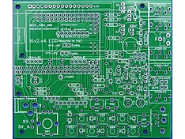
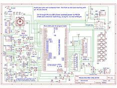
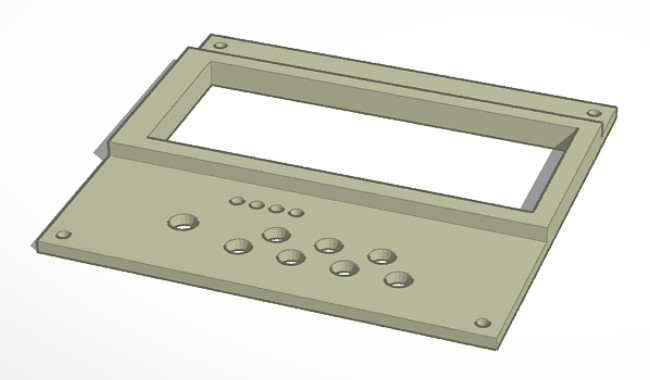

Deze 'fork' van de K3NG Keyer is gemaakt door PI4DEC leden die dit project gemaakt hebben met de K5BCQ pcb.

[Software documentatie staat op K3NG github pagina](https://github.com/k3ng/k3ng_cw_keyer/wiki)

[Hardware documentatie staat op K5BCQ web pagina](https://www.qsl.net/k5bcq/Kits/Keyer.pdf)

 |  
------------------------------------------------------- | ----------------------------------------------------
De gebruikte PCB:                                       | Het schema:

[De PCB kan besteld worden bij K5BCQ](https://www.qsl.net/k5bcq/Kits/Kits.html)

Tijdens het bekijken van het schema vonden enige PI4DEC leden de functie van R23 (100 ohm) in het audio input circuit raadselachtig. In het schema is dit aangegeven als een Goertzel Filter, R23 parallel met C6 (0.1uF). De aanwezigheid van R23 hier lijkt nutteloos of zelfs foutief omdat deze de biasspanning op analoge ingang A0 omlaag trekt. Normaal is deze bias spanning 1/2 Vcc of 2.5 volt. Omdat R23 i.c.m. potmeter R8 een DC weg naar massa geeft zal de bias onder 2 volt gaan, afhankelijk van de stand van R8. 

We hebben wat testen gedaan met en later zonder R23 terwijl potmeter R8 halverwege stond. Bij drie verschillende boards bleek dat het weghalen van R23 positief uitwerkte op de decodeer kwaliteit. Daarom raad ik aan om R23 niet te monteren of indien reeds geplaatst deze te verwijderen. R23 op deze plaats is nutteloos en doet meer kwaad dan goed.

Een is een 3Dprint kastje voor de keyer ontworpen, de geprintte deksel is eerst glad geschuurd en daarna met een spuitbus grijze primer gespoten. Dit geeft het kastje een degelijke uitstraling.

 | - | 
------------------ | ---- | -------------------
 |  | 
**deksel 1** |  **deksel 2**  |  **deksel 3**

Er zijn 3 verschillende frontjes (deksels)  ontworpen. Deksels 1 en 2 hebben een verhoogd kader rondom het gat voor de display. Deksel 3 is vlak en ondersteboven geprint zodat de vlakke onderkant als bovenkant gebruikt wordt. 
deksel 1 heeft een 6mm gat en is voor schakelaars met een lange as, deksels 2 en 3 zijn geschikty voor korte asjes, de knop steekt dan in het kastje.

Naar keuze kan de deksel of het hele kastje met een primer en daarna in een kleurtje gespoten worden.

The files voor ket kastje en de deksel staan op Tinkercad.com

Kastje  : https://www.tinkercad.com/things/8LZc6XmkHG3

Deksel-1: https://www.tinkercad.com/things/4jNfGvMzsKl

Deksel-2: https://www.tinkercad.com/things/jEVnRsXiihz

Deksel-3: https://www.tinkercad.com/things/6QCIQl3qeqy

In de rand v/h kastje zijn gaten voorzien waarin deze draadbussen passen:

https://www.conrad.nl/p/bopla-gewindebuchsen-dodge-m3x65-draadbus-messing-messing-1-stuks-540005

Zodat het deksel met M3 boutjes vastgezet kan worden.
====================================================================================================================

This 'fork' of the K3NG Keyer is prepared by PI4DEC members who made this project with K5BCQ PCB.

[Software documentation is located on K3NG github page](https://github.com/k3ng/k3ng_cw_keyer/wiki)

[Hardware documentation can be found at K5BCQ web pagina](https://www.qsl.net/k5bcq/Kits/Keyer.pdf)

 |  
------------------------------------------------------- | ----------------------------------------------------
The K5BCQ PCB:                                       | Schematic:

When studying the schematic, we at PI4DEC were suspicious of the use of R23 (100 ohm) in the audio input circuit, the so called Goertzel Filter, where it is parallel to C6 (0.1uF). It does not look right to have a resistor at this place because it will pull the bias voltage at analog input A0 lower. Normally this bias voltage should be 1/2 Vcc or 2.5 volt. Because of the DC path to ground over R23 and potmeter R8 (20K) the bias will go below 2 volt depending on the setting of R8.

So we did some tests with and later without R23, while potmeter R8 was set halfway. With three different working boards it appeared that removing R23 gave a slightly better decoding quality. So we advise to not use or when already mounted to remove the resistor. R23 at this place is useless or even faulty.

There is a design for a 3D-printed enclosure, the printed lid can be grinded smooth and sprayed with a primer. This makes the enclosure look more nice.

 | - | 
------------------ | ---- | -------------------
 |  | 
**front 1** |  **front 2**  |  **front 3**

There is a design for three different fronts. front 1 and 2 have a enforced 

</a>
 

This is the 3D-box prototype, not very beatifull printed but it fits very well.

The files for this 3D box for this keyer can be found on Tinkercad.com

The BOX : https://www.tinkercad.com/things/8LZc6XmkHG3-box-for-k3ng-k5bcq-cw-keyer

The LID : https://www.tinkercad.com/things/4jNfGvMzsKl-lid-on-box-k3ng-k5bcq-keyer

THIS PAGE IS A WORK IN PROGRESS.........

https://www.conrad.nl/p/bopla-gewindebuchsen-dodge-m3x65-draadbus-messing-messing-1-stuks-540005
