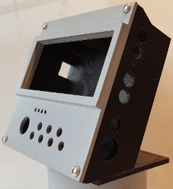
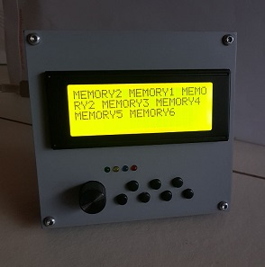

This 'fork' of the K3NG Keyer is designed by PI4DEC members who made this project with K5BCQ PCB.

[Software documentation is located on K3NG github page](https://github.com/k3ng/k3ng_cw_keyer/wiki)

[Hardware documentation can be found at K5BCQ web pagina](https://www.qsl.net/k5bcq/Kits/Keyer.pdf)

 |  
------------------------------------------------------- | ----------------------------------------------------
The K5BCQ PCB:                                       | Schematic:

When studying the schematic, we at PI4DEC were suspicious of the use of R23 (100 ohm) in the audio input circuit, the so called Goertzel Filter, where it is parallel to C6 (0.1uF). It does not look right to have a resistor at this place because it will pull the bias voltage at analog input A0 lower. Normally this bias voltage should be 1/2 Vcc or 2.5 volt. Because of the DC path to ground over R23 and potmeter R8 (20K) the bias will go below 2 volt depending on the setting of R8.

So we did some tests with and later without R23, while potmeter R8 was set halfway. With three different working boards it appeared that removing R23 gave a slightly better decoding quality. So we advise not to use R23 or when already mounted to remove it.  R23 at this place is useless or even faulty.

There is a design for a 3D-printed enclosure, the printed lid can be grinded smooth and sprayed with a primer. This makes the enclosure look more solid.

 |  | 
------------------ | ---- | -------------------
 |  | 
**front 1** |  **front 2**  |  **front 3**

There is a design for three different fronts. front 1 and 2 have a framework arond the display. Front 3 is smooth and must be used reversed so the smooth bottom will be on top. 
Front 1 has a 6mm hole and is for switches with a long shaft, front 2 and 3 can be used with short shafts, the knob will go through the 15mm hole.

The files for the enclosure can be found on Tinkercad.com

Box     : https://www.tinkercad.com/things/8LZc6XmkHG3

Front-1: https://www.tinkercad.com/things/4jNfGvMzsKl

Front-2: https://www.tinkercad.com/things/jEVnRsXiihz

Front-3: https://www.tinkercad.com/things/6QCIQl3qeqy

In the sidewalls of the box are 4  holes which will fit for these threaded busses
htps://www.conrad.nl/p/bopla-gewindebuchsen-dodge-m3x65-draadbus-messing-messing-1-stuks-540005

Now the lid can be bolted to the box. There is also a small stand that can be mounted to the side. Then enclosure can be used standing up.
