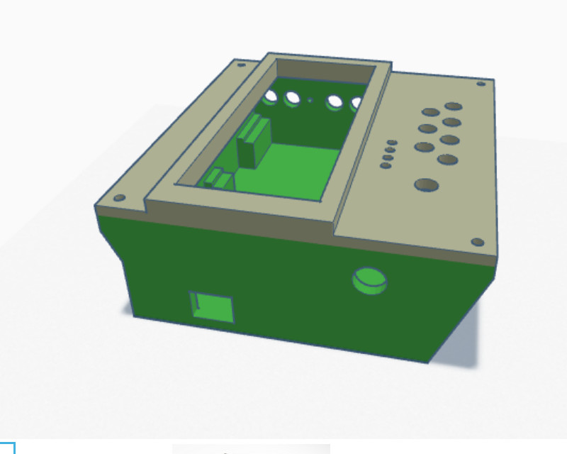

# K3NG - K5BCQ cw keyer

<a href="/Nederlands.md">Link  naar de Nederlandse Readme file.</a>

<a href="/English.md">Link  to the English Readme file.</a>

This K3NG Keyer fork is tailord for the K5BCQ Printed Circuit Board.

A 3D-printed Box for the keyer can be found on Tinkercad.com

</a>
 
