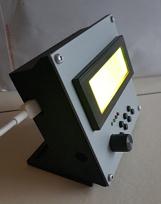
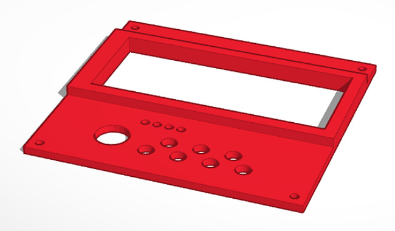

Deze 'fork' van de K3NG Keyer is gemaakt door PI4DEC leden die dit project gemaakt hebben met de K5BCQ pcb.

[Software documentatie staat op K3NG github pagina](https://github.com/k3ng/k3ng_cw_keyer/wiki)

[Hardware documentatie staat op K5BCQ web pagina](https://www.qsl.net/k5bcq/Kits/Keyer.pdf)

[De PCB kan besteld worden bij K5BCQ](https://www.qsl.net/k5bcq/Kits/Kits.html)

 |  
------------------------------------------------------- | ----------------------------------------------------
De gebruikte PCB:                                       | Het schema:

[Nederlandstalige documentatie van de hand van PA0GTB](2019_Arduino_voor_radioamateurs_deel_10.docx)

###### *n.b. via DEC of PA0GTB zijn nog enige printen beschikbaar*

[Onderdelenlijst voor de keyer](bom-cw-keyer.docx)

Tijdens het bekijken van het schema vonden enige PI4DEC leden de functie van R23 (100 ohm) in het audio input circuit raadselachtig. In het schema is dit aangegeven als een Goertzel Filter, R23 parallel met C6 (0.1uF). De aanwezigheid van R23 hier lijkt nutteloos of zelfs foutief omdat deze de biasspanning op analoge ingang A0 omlaag trekt. Normaal is deze bias spanning 1/2 Vcc of 2.5 volt. Omdat R23 i.c.m. potmeter R8 een DC weg naar massa geeft zal de bias onder 2 volt gaan, afhankelijk van de stand van R8.

We hebben wat testen gedaan met en later zonder R23 terwijl potmeter R8 halverwege stond. Bij drie verschillende boards bleek dat het weghalen van R23 positief uitwerkte op de decodeer kwaliteit. Daarom raad ik aan om R23 niet te monteren of indien reeds geplaatst deze te verwijderen. R23 op deze plaats is nutteloos en doet meer kwaad dan goed.

Een is een 3Dprint kastje voor de keyer ontworpen, de geprintte deksel is eerst glad geschuurd en daarna met een spuitbus grijze primer gespoten. Dit geeft het kastje een degelijke uitstraling.

 |  | 
------------------ | ---- | -------------------
 |  | 
**deksel 1** |  **deksel 2**  |  **deksel 3**

Er zijn 3 verschillende frontjes (deksels)  ontworpen. Deksels 1 en 2 hebben een verhoogd kader rondom het gat voor de display. Deksel 3 is vlak en ondersteboven geprint zodat de vlakke onderkant als bovenkant gebruikt wordt. 
deksel 1 heeft een 6mm gat en is voor schakelaars met een lange as, deksels 2 en 3 zijn geschikty voor korte asjes, de knop steekt dan in het kastje.

Naar keuze kan de deksel of het hele kastje met een primer en daarna in een kleurtje gespoten worden.

The files voor ket kastje en de deksel staan op Tinkercad.com

Kastje  : https://www.tinkercad.com/things/8LZc6XmkHG3

Standaard : https://www.tinkercad.com/things/85wWPwAi7wy

Deksel-1: https://www.tinkercad.com/things/4jNfGvMzsKl

Deksel-2: https://www.tinkercad.com/things/jEVnRsXiihz

Deksel-3: https://www.tinkercad.com/things/6QCIQl3qeqy

In de rand v/h kastje zijn gaten voorzien waarin deze draadbussen passen:

https://www.conrad.nl/p/bopla-gewindebuchsen-dodge-m3x65-draadbus-messing-messing-1-stuks-540005

Zodat het deksel met M3 boutjes vastgezet kan worden.
