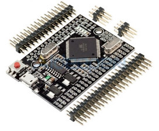
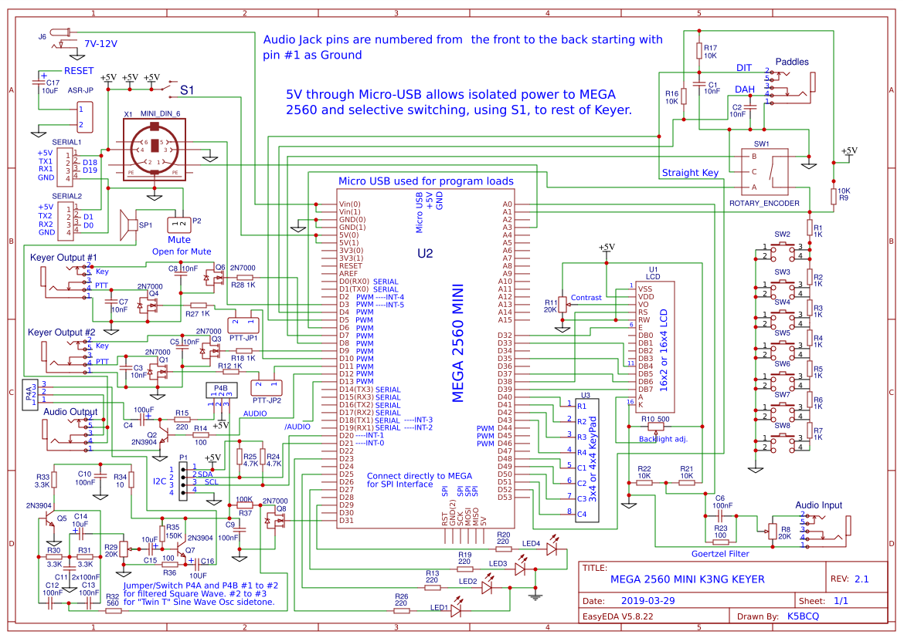
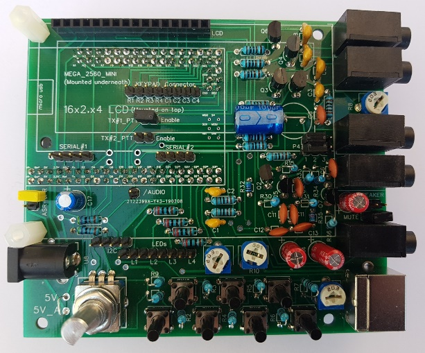
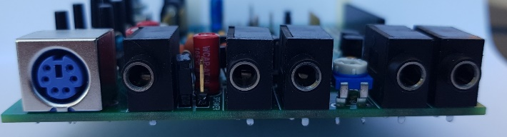
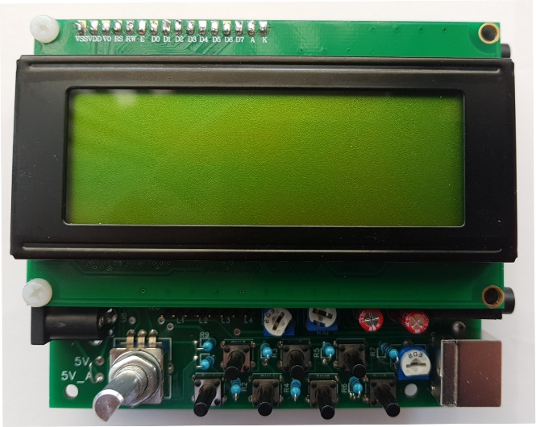
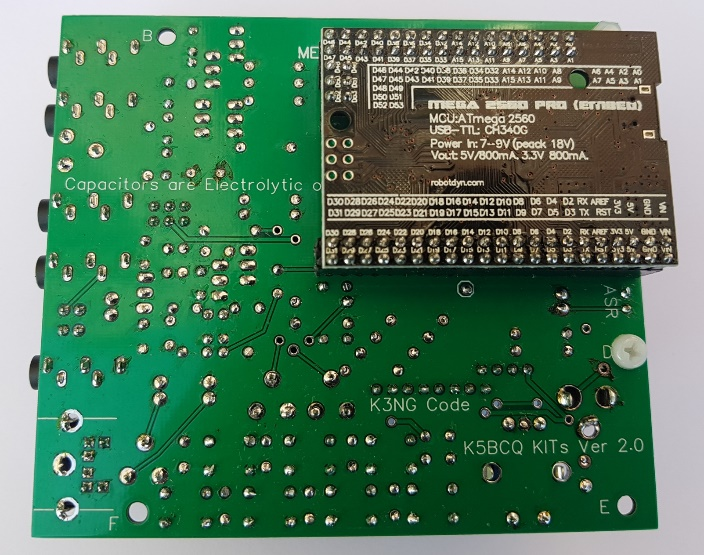
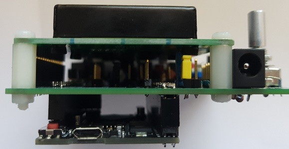

### Arduino voor radioamateurs__ Deel 10  - - (door Cor Struyk paogtb@veron.nl)

# K3NG – CW Memory Keyer met CW Decoder

Het afgelopen jaar ben ik door vele Radio-Amateurs benaderd met de vraag of er naast de eerder gepubliceerde aparte CW decoders en de CW Keyboard-Keyer, ook iets gecombineerd zou kunnen worden.
Welnu, dat was iets waar ik zelf ook al langer naar uit keek, om een goed ontwerp met “alles in een” te vinden, wat voldoende gedocumenteerd was en ook geschikt voor nabouw

Al langer was ik bezig om informatie te verzamelen op basis van het CW Keyer ontwerp van K3NG Waarvan diverse varianten op basis van een Arduino Nano of een Arduino Mega2560 te vinden zijn.
Veel ontwerpen gaan echter alleen uit van het CW keyer concept zonder aandacht te schenken aan de CW decoder. 
De meeste ontwerpen op basis van een Arduino Mega2560 zijn ook gebaseerd op het principe van een extra shield met knoppen en aansluitingen voor een normale morse sleutel en/of Paddels met hierbij een PS2-keyboard
aansluiting voor de instellingen van de geheugens of om CW te verzenden.

### Het K3NG zelfbouw ontwerp van Kees, K5BCQ
Eind 2018 viel mijn oog op het concept “Big CW Keyer K3NG” van Kees, K5BCQ, die bezig was om een zelfbouwproject te ontwikkelen op basis van het K3NG Memory Keyer principe, maar waarbij alle opties die maar mogelijk zijn op dit concept, inclusief zouden zijn.

Het basisontwerp van K3NG bestaat uit een op Arduino gebaseerde CW (Morse Code) keyer. Het betreft een zeer flexibel opgezet ontwerp met veel opties, wat echt kan concurreren met vergelijkbare commercieel verkrijgbare producten. Omdat het op basis van de Arduino Open Source code is gebaseerd, kan het volledig op de individuele wensen van gebruikers worden afgestemd.
Kees, K5BCQ, ontwierp voor het totaalconcept, met alle mogelijke opties, een dubbelzijdige printplaat waarop alles onderdelen, inclusief de Arduino Microcontroller en een keuze uit divers3e afmetingen displays, is voorzien.
Ik had het geluk dat ik als een van zijn Beta-testers mocht fungeren !  Ik heb 2 versies van het totaal-concept gebouwd, met nu dit definitieve ontwerp als eindresultaat.

### De opties welke in dit zelfbouwproject K3NG keyer zijn inbegrepen, bestaan uit :

    • CW-snelheid instelbaar van 1 tot 999 WPM. 
    • Maximaal zes selecteerbare zender sleutellijnen. ( waarvan 2 uitgevoerd op de print) 
    • Programmering en interfacing via USB-poort ("command line interface") 
    • USB of PS2 toetsenbord interface voor CW toetsenbord operatie zonder een computer. 
    • Logging en Contest Program Interfacing via K1EL Winkey 1.0 en 2.0 interface protocol emulatie.
    • Command Line Interface (CLI) 
    • PTT-uitvoeringen met instelbare lead-, tail- en hangtijden. 
    • LCD Display aansluiting. 16x2, 16x4 en 20x4 LCD displays zijn mogelijk.  Zowel parallel als I2C bus aansluiting. 
    • Tot 12 geheugens met macro's. ( 7 met knoppen uitgevoerd op de print)
    • Het gebruik van Serienummers. ( bv voor Contesten).
    • CW toetsenbord (via een terminal server programma zoals Termite of de Arduino Serial monitor). 
    • Snelheid instelbaar met een “Rotary Encoder”. Snelheid is ook instelbaar met commando's QRSS en HSCW. 
    • Baken en  Fox modus. 
    • Iambic A en B. 
    • Diverse morse sleutel modus instellingen( standaard, Ultimatic, Iambic, etc..)
    • CMOS Super Keyer Iambic B Timing. 
    • Paddle reverse. 
    • Hellschreiber modus (toetsenbord verzenden, geheugen macro, baken) Farnsworth Timing. 
    • Instelbare frequentie-sidetone.  
    • Command modus voor het gebruik van de paddel om instellingen te wijzigen, programma herinneringen, enz. 
    • Keying Compensation. 
    • Dah naar Dit ratio aanpassing. 
    • Diverse CW oefen modus. 
    • Geheugen stapelen. 
    • "Dead Operator Watchdog". 
    • Automatische spatie instelling
    • Woordspatie instelling. 
    • Voorgeprogrammeerde en zelf instelbare Prosigns
    • Opslag van alle gemaakte instellingen
    • Blijvende opslag van de meeste instellingen. 
    • CW Ontvangst Decoder met Goertzel Filter.
    • Slaapstand. 
    • USB-muis ondersteuning. 
    • Mayhew LED Ring Support Alfabet Verzendpraktijk. 
    • USB-toetsenbord HID (Human Interface Device) Interface (Keyer = toetsenbord voor uw computer)
    • 3x4 of 4x4 toetsenbord voor diverse toepassingen  
    
### Hardware opbouw van het K5BCQ ontwerp

**H**et hele ontwerp is opgebouwd rondom een kleinere versie  van de Arduino Mega2560, namelijk de Arduino Mega2560 Pro Mini. | 
----------- | --------------

Deze verkleinde uitvoering is qua capaciteit en mogelijkheden gelijk aan zijn grote broer, de Mega2560.  Van deze versie Arduino, bestaan meerdere uitvoeringen. Alleen de “Zwarte printplaat” 
uitvoering van bijvoorbeeld Robotdyn, met mini-USB aansluiting is de juiste versie.  Let daar op als je dit project gaat bouwen !.

<u>Opmerking </u> : 
Er zijn ook aanbiedingen op diverse websites te vinden, waarbij de benodigde dubbele Pin headers al in de levering zijn inbegrepen. Een kwestie van even verder kijken dus.

### Het Schema

In bovenstaand schema, zijn alle benodigde onderdelen en aansluitingen zoals deze voor de printplaat benodigd zijn ingetekend.

### De printplaat

#### Er is op de printplaat qua aansluitingen voorzien in :

    • Een aansluiting voor een normale seinsleutel of paddels
    • Een audio ingang voor de CW decoder
    • Een audio uitgang voor bv een hoofdtelefoon
    • Een luidspreker aansluiting
    • 2 onafhankelijk te gebruiken Keyer – uitgangen, TX aansluiting
    • Een PS2 keyboard aansluiting
    • Een 3x4 of 4x4 toetsenbord aansluiting
    • Een parallel display aansluiting voor een 16x2, 16x4 of 20x4 LCD display
    • Een aparte I2C (Seriële bus) aansluiting
    • 2 aparte Seriële bus aansluitingen voor diverse toepassingen
    • Een Rotary Encoder voor snelheidsinstellingen
    • Een Commando Mode drukknop via de Rotary Encoder Switch
    • 7 programmeerbare geheugen drukknoppen
    • 4 Led signaleringen
    • Een instelbaar side-tone filter
    • Een micro USB aansluiting voor programmering of voeding van de Mega2560
    • Een aparte 7-12 Volt voedingsaansluiting
    • Een aan/uit schakelaar aansluiting

Alle onderdelen worden op de voorzijde van de print gemonteerd, met uitzondering van de Arduino Mega2560 Pro Mini.  Die wordt op een speciale manier met headers gemonteerd op de achterzijde van de printplaat.
Zoals eerder aangegeven kunnen we verschillende afmetingen displays worden toegepast. Ook het display wordt middels een 16 polige male / female header gemonteerd, net zoals we dat ook al bij voorgaande projecten hebben gedaan.  Het is dus ook mogelijk om bijvoorbeeld bij inbouw in een kastje het display met een korte bandkabel te monteren.

 | 
-------- | --------

###### Arduino Mega2560 Pro Mini wordt gemonteerd middels Male/Female headers op de onderzijde van de printplaat

### De sketch en libraries
Vanwege de vele opties en het kunnen instellen op persoonlijk gebruik, bestaat de software niet alleen uit een grote sketch en noodzakelijke libraries, maar ook uit een aantal hulp-instellings-files.
De belangrijkste instellingfiles, waar je naast de sketch de opties in opgeeft waar je gebruik van wil maken, bestaan uit :

    • keyer_featues_and_options.h
    • keyer_pin_settings.h
    • keyer_settings.h
    • keyer.h

Er zijn er nog wel een aantal, maar daar hoef je in principe geen veranderingen in aan te brengen.
De benodigde libraries komen uiteraard in je Library folder te staan.  Om geen problemen te krijgen met reeds bestaande libraries, is het aan te bevelen om bestaande libraries in de folder Libraries, tijdelijk even op een ander plaats neer te zetten, zodat conflicten worden vermeden.
De sketch : k3ng_keyer.ino en alle benodigde hulp-instellings-files, <naam>.h,  dienen bij elkaar in een folder te komen staan. Bijvoorbeeld : C: \documenten\Arduino\Je_call\..........

Regelmatig verschijnen er updates en aanvullingen op deze programmatuur. Ook de auteur, K3NG zelf, stuurt nog regelmatig uitbreidingen. Het is daarom verstandig om alle benodigde programmatuur en libraries zelf te downloaden op :
https://github.com/k3ng/k3ng_cw_keyer
Download daar via de GROENE KNOP de hele Zipfile zodat je alle laatste versies van programmatuur en libraries hebt.
Pak vervolgens de Zipfile uit, en installeer alle files zoals hierboven beschreven.

### Documentatie K3NG CW keyer algemeen
Een dergelijk uitgebreid project met zoveel opties en mogelijkheden, kan natuurlijk niet zonder documentatie. Op de Github website https://github.com/k3ng/.k3ng_keyer/wiki  vindt je een uitgebreide documentatie over dit mooie K3NG keyer ontwerp.
Documentatie K3NG bouwproject van Kees, K5BCQ
De specifieke  documentatie over dit bouwproject zelf, zal door mij via de VERON downloadsite beschikbaar worden gesteld.

### Onderdelen, printplaat en bouwpakket
Buiten de printplaat zijn alle onderdelen via Arduino ondersteunende electronica-shops of via Ebay en Aliexpress verkrijgbaar. Let er bij de aanschaf van de Arduino Mega2560 Pro Mini op,  dat je de uitvoering met zwarte printplaat van Robotdyn neemt, welke ook voorzien is van een micro-USB aansluiting en zo mogelijk de benodigde Pinheaders.

De printplaat zelf zou in principe via Kees, K5BCQ moeten worden aangeschaft. Maar vanwege het feit dat de verzendkosten vanuit de USA naar NL tegenwoordig vrij hoog zijn, heb ik de Gerber-files voor de print beschikbaar. Ik kan je die op verzoek beschikbaar stellen zodat je zelf printen kunt laten maken.

Bij voldoende belangstelling ben ik tevens bereid om een aantal printen te bestellen en te leveren. Zie voor meer informatie de Rubriek Eraan / ErAf op het Veron Techniek Forum ( zie www.veron.nl)

### Praktijkervaringen
Ik heb de afgelopen jaren verschillende op Arduino gebaseerde uitvoeringen CW decoders en CW keyers gebouwd. Het K3NG ontwerp heeft mij altijd al geboeid, maar ik vond het toen nog te eenzijdig.
Het nieuwe totaalconcept van Kees, K5BCQ, waarin op 1 printplaat alle extra uitbreidingen en opties van het K3NG ontwerp zijn terug te vinden, inclusief een CW decoder, was een openbaring.
Ook hier kan de niet CW-kennis-machtige radioamateur via het USB of PS2 keyboard gebruikmaken van alle facetten van een volwaardige CW keyer en decoder.
In de praktijk is het even zoeken en oefenen om de juiste instellingen te vinden, maar dat eenmaal goed ingesteld is het een perfecte aanvulling in de shack.

### Bijlage voor download
De bij deze aflevering bijbehorende downloadfile, is weer te vinden op << Veron download site >>. 
In de ZIP file zit  : 

    • Het uitgebreide schema
    • De benodigde onderdelenlijst 
    • Print aanzicht tekeningen e.d. 
    • Hints en tips over verkrijgbaarheid van specifieke onderdelen

Veel succes met de nabouw van dit mooie  K5BCQ / K3NG CW keyer / decoder project
73 de Cor, PA0GTB
